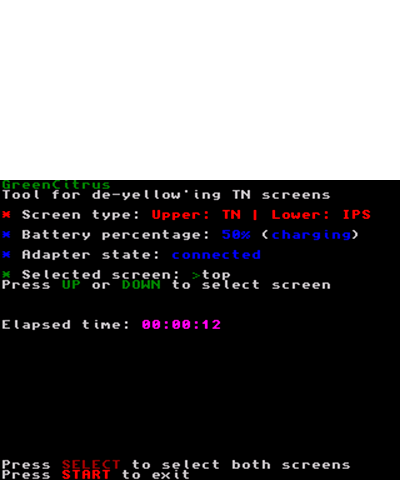

# GreenCitrus

## Citrus de-yellow'ing Tool for TN Screens

GreenCitrus is a homebrew project for the Nintendo 3DS, designed to mitigate the yellow tint often found on TN screens. The tool works by filling the TN screen with a white color at maximum brightness for an extended period.



### Features

- Detects screen type (TN or IPS) on New Nintendo 3DS systems.
- Displays static and dynamic information about the system's screen type, battery status, and adapter state.
- Allows users to select the screen to be de-yellowed (top or bottom).
- Provides a simple and user-friendly interface.

### How It Works

1. **Screen Detection**: GreenCitrus detects whether the device is a New Nintendo 3DS and identifies the type of screens (TN or IPS) installed.
2. **De-Yellow'ing Process**: By setting the TN screen to display white at maximum brightness for an extended duration (recommended between 6 hours to 24 hours), the yellow tint can be reduced or eliminated.
3. **User Interaction**: Users can interact with the tool using the D-pad to select which screen to de-yellow, and view relevant information such as battery percentage and adapter state.

### Installation

1. Download the latest release of GreenCitrus from the [Releases](https://github.com/Pugemon/GreenCitrus/releases) page.
2. Copy the `.3dsx` file to the `/3ds/` directory on your 3DS SD card.
3. Launch the Homebrew Launcher on your 3DS and select GreenCitrus.

### Usage

1. Start GreenCitrus from the Homebrew Launcher.
2. Follow the on-screen instructions to select the screen you want to de-yellow.
3. Allow the tool to run for the recommended duration (6 hours to 24 hours) to achieve the best results.

### Building from Source

To build GreenCitrus from source, you will need the following:

- DevkitARM
- citro2d
- citro3d
- CMake

Clone the repository and build using CMake:

```sh
git clone https://github.com/Pugemon/GreenCitrus.git
cd GreenCitrus
mkdir ./build
/opt/devkitpro/portlibs/3ds/bin/arm-none-eabi-cmake -B ./build -S .
cd ./build
make
```

### Contributing
Contributions are welcome! Please fork the repository and submit a pull request with your changes.

### License
GreenCitrus is licensed under the MIT License. See the [LICENSE](LICENSE.md) file for more details.

### Inspiration
This homebrew was inspired by a video by Jake64. You can watch it [here](https://www.youtube.com/watch?v=O6RW3YzTTJM).

---

GreenCitrus is designed to improve the viewing experience on TN screens by reducing the yellow tint. We hope you find it useful! If you have any questions or feedback, please open an issue on our [GitHub repository](https://github.com/Pugemon/GreenCitrus/issues).